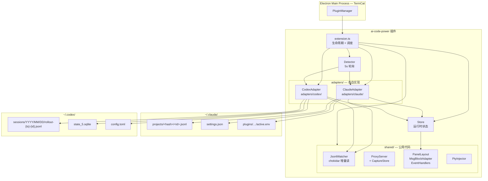
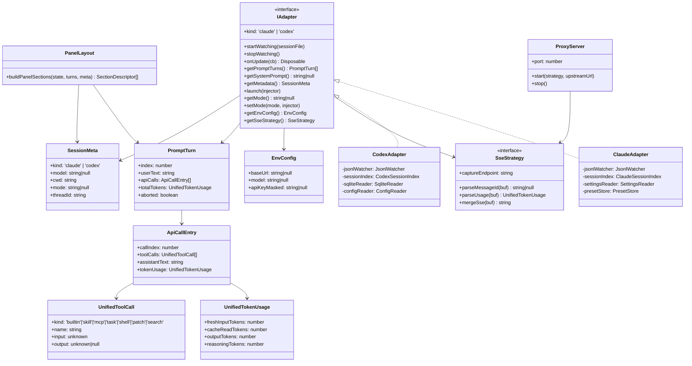
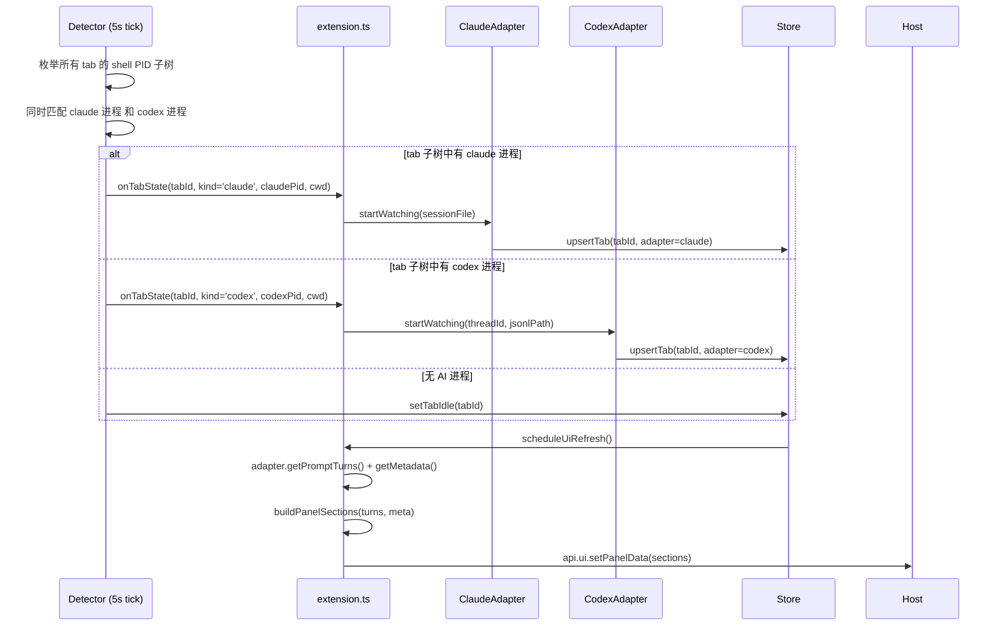
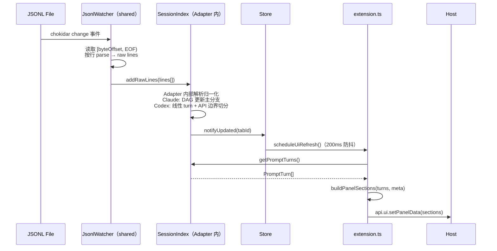
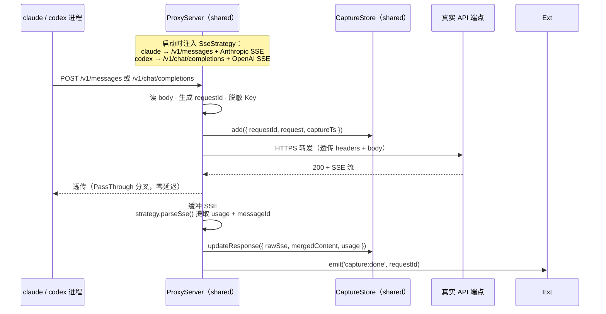
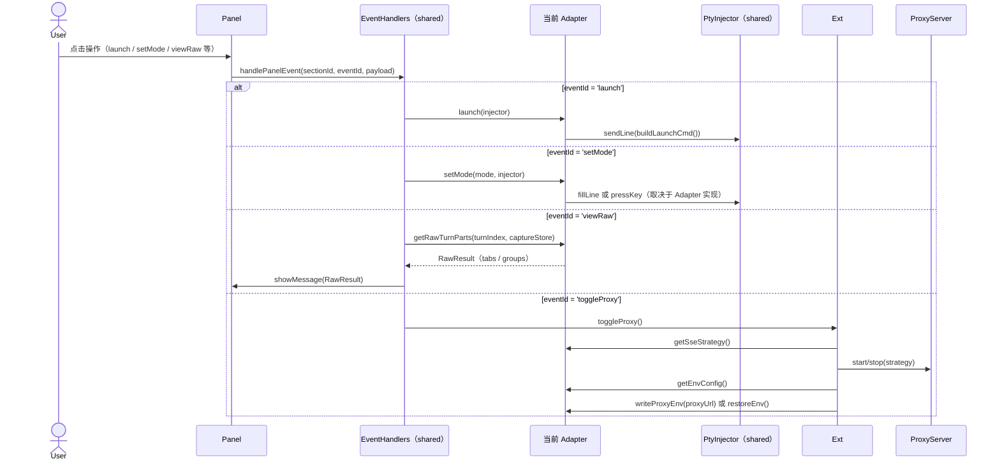

# 20260621-AiCodePower

**功能**：统一增强面板插件，在 TermCat 右侧边栏检测到 `claude` 或 `codex` 进程后，自动注入对应的会话历史、调用详情（工具调用分类）、Token 统计和原始请求/响应查看能力。两个 CLI 共用一套 UI 渲染逻辑，通过可插拔 Adapter 层隔离数据差异。

---

## 1. 架构设计

### 1.1 整体架构



### 1.2 模块类图



### 1.3 目录结构：公用 vs Adapter 各自实现

```
ai-code-power/src/
│
├── extension.ts                    # 公用：生命周期、Adapter 调度、面板推送
├── core/
│   ├── state.ts                    # 公用：运行时状态（per-tab、proxy 状态）
│   ├── types.ts                    # 公用：PromptTurn / ApiCallEntry / UnifiedTokenUsage /
│   │                               #        UnifiedToolCall / SessionMeta / EnvConfig
│   └── event-bus.ts                # 公用：内部事件总线
│
├── detector/
│   └── process-watcher.ts          # 公用：同时检测 claude + codex 进程，按 kind 分发
│
├── shared/
│   ├── data/
│   │   └── jsonl-watcher.ts        # 公用：chokidar 增量读取，按 projectDir 去重
│   ├── proxy/
│   │   ├── proxy-server.ts         # 公用：HTTP 监听 + PassThrough 分叉 + CaptureStore 写入
│   │   └── capture-store.ts        # 公用：LRU 200 条内存存储
│   ├── actions/
│   │   └── pty-inject.ts           # 公用：fillLine / sendLine，per-session 串行队列
│   └── ui/
│       ├── panel-layout.ts         # 公用：buildPanelSections（meta.kind 控制差异 section）
│       ├── msg-block-adapter.ts    # 公用：PromptTurn[] → MsgBlock[]
│       ├── msg-block-types.ts      # 公用：MsgBlock 类型定义
│       └── event-handlers.ts       # 公用：handlePanelEvent 主分发（调用 adapter 方法）
│
├── adapters/
│   ├── types.ts                    # 公用：IAdapter / SseStrategy 接口定义
│   │
│   ├── claude/                     # ── ClaudeAdapter 各自实现 ──
│   │   ├── index.ts                # IAdapter 实现入口
│   │   ├── process-detector.ts     # 检测 claude 进程，读 ~/.claude/sessions/<pid>.json
│   │   ├── project-hash.ts         # cwd → ~/.claude/projects/<encoded>/ 路径编码
│   │   ├── jsonl-parser.ts         # 解析 Claude JSONL（user/assistant/attachment 类型）
│   │   ├── session-index.ts        # parentUuid DAG 构建 + 主分支提取
│   │   ├── settings-reader.ts      # 读写 ~/.claude/settings.json（defaultMode）
│   │   ├── preset-store.ts         # Preset 管理（API Key / model / env）
│   │   ├── active-env-writer.ts    # 写 active.env（set -a; source; set +a 格式）
│   │   ├── launch.ts               # 注入启动命令（source active.env + claude）
│   │   ├── drive-mode.ts           # 切换 PermissionMode（Shift+Tab / /permission-mode）
│   │   └── sse-strategy.ts         # SseStrategy 实现：/v1/messages + Anthropic SSE 解析
│   │
│   └── codex/                      # ── CodexAdapter 各自实现 ──
│       ├── index.ts                # IAdapter 实现入口
│       ├── process-detector.ts     # 检测 codex/codex-tui 进程，获取 cwd
│       ├── sqlite-reader.ts        # 读 state_5.sqlite threads 表，返回 thread_id + created_at_ms
│       ├── jsonl-path-resolver.ts  # created_at_ms → YYYY/MM/DD → JSONL 路径（含 glob 回退）
│       ├── jsonl-parser.ts         # 解析 Codex JSONL（session_meta/event_msg/response_item）
│       ├── session-index.ts        # 线性 turn_id 分组，按 token_count 切分 ApiCallEntry
│       ├── config-reader.ts        # 读 ~/.codex/config.toml（model / baseUrl）
│       ├── launch.ts               # 注入 codex 启动命令
│       ├── approval-mode.ts        # 读取 approval_mode（来自 sqlite / turn_context）
│       └── sse-strategy.ts         # SseStrategy 实现：/v1/chat/completions + OpenAI SSE 解析
```

### 1.4 公用 vs 各自实现对照表

| 能力域 | 公用（shared/） | ClaudeAdapter | CodexAdapter |
|--------|----------------|---------------|--------------|
| **JSONL 增量监听** | `jsonl-watcher.ts` | — | — |
| **JSONL 路径定位** | — | `project-hash.ts` | `sqlite-reader.ts` + `jsonl-path-resolver.ts` |
| **JSONL 解析** | — | `jsonl-parser.ts`（DAG 类型） | `jsonl-parser.ts`（事件类型） |
| **会话索引** | — | `session-index.ts`（DAG→线性） | `session-index.ts`（线性+API边界） |
| **进程检测** | `process-watcher.ts`（统一轮询框架） | `process-detector.ts`（claude 特征） | `process-detector.ts`（codex 特征） |
| **启动进程** | `pty-inject.ts`（底层写 PTY） | `launch.ts`（source active.env + claude） | `launch.ts`（codex 命令） |
| **模式管理** | — | `drive-mode.ts` + `settings-reader.ts` | `approval-mode.ts` + `config-reader.ts` |
| **环境配置** | — | `preset-store.ts` + `active-env-writer.ts` | `config-reader.ts` |
| **代理核心** | `proxy-server.ts` + `capture-store.ts` | — | — |
| **代理协议** | — | `sse-strategy.ts`（Anthropic SSE） | `sse-strategy.ts`（OpenAI SSE） |
| **UI 渲染** | `panel-layout.ts` + `msg-block-adapter.ts` | — | — |
| **面板事件分发** | `event-handlers.ts` | — | — |

---

## 2. 关键流程时序图

### 2.1 Detector 检测 + Adapter 绑定



### 2.2 JSONL 增量更新 → 面板刷新



### 2.3 代理捕获流（两 Adapter 共用 ProxyServer）



### 2.4 面板操作路由（event-handlers 分发到 Adapter）



---

## 3. 关键逻辑

### 3.1 同一 tab 同时存在两种 CLI 进程的冲突处理

**问题**：极少数情况下，用户在同一 tab 的 shell 子树中可能同时存在 `claude` 和 `codex` 进程（嵌套调用）。

**候选方案**：
- A. **优先取最晚启动的进程**：比较 `starttime`，选最新的。理由：用户大概率在用最新启动的那个。
- B. **优先 claude**：claude_code_power 已有稳定支持，选 claude 保守。
- C. **同时显示，双面板**：UI 复杂度高，宿主 API 不支持。

**选 A**：通过 `ps -o pid=,etime=` 比较启动时间，选最新进程对应的 CLI 类型。不引入额外 UI 状态。

### 3.2 统一 PromptTurn 接口的字段设计

**问题**：Claude 的 session 是 `parentUuid` DAG（支持分支/rewind），Codex 是线性 `turn_id` 序列，内部结构差异大，但 UI 消费同一套 `PromptTurn[]`。

**候选方案**：
- A. **完全归一化**：Adapter 内部消化差异，`getPromptTurns()` 对外只暴露线性列表。UI 零感知。**选此方案**。
- B. **鸭子类型 + 可选字段**：差异字段标 `?`，UI 按需 check。字段语义模糊，易出错。
- C. **两套独立类型**：UI 必须按 kind 分支，回归"两套 UI"问题。

**选 A 的关键设计**：
- `UnifiedTokenUsage` 统一四字段，两侧缺失的填 0
- `UnifiedToolCall.kind` 枚举覆盖两侧工具体系，UI 统一按 kind 映射图标
- Claude DAG 主分支提取、Codex `token_count` 边界切分，全在 Adapter 内部完成

### 3.3 IAdapter 中 launch / setMode / getEnvConfig 的设计边界

**问题**：启动命令、模式切换、环境配置三块，两个 CLI 实现完全不同，但 `event-handlers.ts` 需要统一调用入口。

**方案**：将这三块纳入 `IAdapter` 接口契约，Adapter 各自实现，`EventHandlers` 只调用接口方法，不感知实现差异：
- `launch(injector)`：Claude 注入 `source active.env + claude`；Codex 注入 `codex` 命令
- `setMode(mode, injector)`：Claude 用 Shift+Tab 或 `/permission-mode`；Codex 目前为只读展示（approval_mode 无法通过 PTY 动态切换，需重启时传参）
- `getEnvConfig()`：Claude 返回 PresetStore 的 active preset；Codex 返回 config.toml 解析结果

### 3.4 ProxyServer 支持两套端点和 SSE 格式

**问题**：Claude 使用 `/v1/messages` + Anthropic SSE，Codex 使用 `/v1/chat/completions` + OpenAI SSE，格式差异大。

**候选方案**：
- A. **SseStrategy 策略注入**：`ProxyServer` 接收 `SseStrategy` 接口，启动时由 Adapter 提供实例。**选此方案**。
- B. **两个独立 ProxyServer**：代码重复，维护两份核心逻辑。
- C. **运行时 if 判断**：ProxyServer 与 Adapter 耦合，违反分层原则。

**选 A**：PassThrough 分叉、CaptureStore 写入、限速等核心逻辑完全共用，仅 `captureEndpoint`、`parseMessageId`、`parseUsage`、`mergeSse` 四个方法各自实现。

### 3.5 代理开关的 env 写回（两 Adapter 各自处理）

**问题**：开启代理后需将 `ANTHROPIC_BASE_URL` 或 `OPENAI_BASE_URL` 指向本地代理；关闭后需还原，且两 CLI 的 env 写入机制不同。

**方案**：在 `IAdapter` 中增加 `writeProxyEnv(proxyUrl)` / `restoreEnv()` 方法：
- Claude：写入 `active.env`（writeActiveEnv with overrideBaseUrl）
- Codex：写入 `~/.codex/config.toml` 的 `base_url` 字段，或注入 `export OPENAI_BASE_URL=...` 到 PTY

### 3.6 CodexAdapter 的 JSONL 路径定位

**问题**：Codex JSONL 路径含日期分区 `YYYY/MM/DD`，无法直接从 cwd 推算。

**候选方案**：
- A. **SQLite 优先**：查 `state_5.sqlite` 获取 `created_at_ms`，推算日期，拼路径。**选此方案**。
- B. **glob 扫描**：递归查找含 thread_id 的文件名。扫描慢，目录大时性能差。
- C. **纯时间推算**：用进程启动时间推算日期。跨午夜 session 会出错。

**选 A 为主，B 为回退**：SQLite 不可用时 glob 兜底。

---

## 4. 接口说明

### 4.1 IAdapter 完整接口

| 方法 / 属性 | 类型 | 说明 |
|-------------|------|------|
| `kind` | `'claude' \| 'codex'` | Adapter 类型标识 |
| `startWatching(file, opts)` | `Promise<void>` | 开始监听 JSONL，注册 chokidar watcher |
| `stopWatching()` | `void` | 停止监听，释放资源 |
| `onUpdate(cb)` | `Disposable` | 有新事件时通知 |
| `getPromptTurns()` | `PromptTurn[]` | 归一化 turn 列表（升序） |
| `getSystemPrompt()` | `string \| null` | 系统提示（Codex 来自 session_meta；Claude 需代理或 null） |
| `getMetadata()` | `SessionMeta` | 当前会话元数据（model / cwd / mode / threadId） |
| `launch(injector)` | `Promise<void>` | 向 PTY 注入启动命令 |
| `getMode()` | `string \| null` | 当前模式（Claude: permissionMode；Codex: approval_mode） |
| `setMode(mode, injector)` | `Promise<void>` | 切换模式（Claude 可执行；Codex 仅展示或提示重启） |
| `getEnvConfig()` | `EnvConfig` | 当前环境配置（baseUrl / model / apiKeyMasked） |
| `writeProxyEnv(proxyUrl)` | `Promise<void>` | 开启代理：将 baseUrl 指向本地代理端口 |
| `restoreEnv()` | `Promise<void>` | 关闭代理：还原原始 baseUrl |
| `getSseStrategy()` | `SseStrategy` | 返回代理协议策略（端点 + SSE 解析实现） |

### 4.2 SseStrategy 接口（ProxyServer 注入）

| 方法 / 属性 | 类型 | Claude 实现 | Codex 实现 |
|-------------|------|-------------|------------|
| `captureEndpoint` | `string` | `/v1/messages` | `/v1/chat/completions` |
| `parseMessageId(buf)` | `string \| null` | 从 `message_start` event 提取 `msg_xxx` | 从首个 chunk 提取 `chatcmpl-xxx` |
| `parseUsage(buf)` | `UnifiedTokenUsage` | 从 `message_start` event 的 `usage` 字段 | 从最后非 `[DONE]` chunk 的 `usage` 字段 |
| `mergeSse(buf)` | `string` | 合并 `content_block_delta` 事件 | 合并 `choices[0].delta.content` |

### 4.3 UnifiedTokenUsage Schema

| 字段 | 类型 | Claude 来源 | Codex 来源 |
|------|------|-------------|------------|
| `freshInputTokens` | `number` | `input_tokens + cache_creation_input_tokens` | `input_tokens` |
| `cacheReadTokens` | `number` | `cache_read_input_tokens` | `cached_input_tokens` |
| `outputTokens` | `number` | `output_tokens` | `output_tokens` |
| `reasoningTokens` | `number` | 0 | `reasoning_output_tokens` |

### 4.4 UnifiedToolCall Schema

| 字段 | 类型 | 说明 |
|------|------|------|
| `kind` | 见下表 | 工具类型，决定 UI 图标 |
| `name` | `string` | 工具名 |
| `input` | `unknown` | 调用入参 |
| `output` | `unknown \| null` | 返回值（null 表示尚未返回） |

**kind 映射**：

| 条件 | kind | 来源 |
|------|------|------|
| `name === 'Skill'` | `skill` | Claude |
| `name.startsWith('mcp__')` | `mcp` | Claude |
| `name === 'Task'` | `task` | Claude |
| `type = 'function_call'`, name = `exec_command` | `shell` | Codex |
| `type = 'custom_tool_call'`, name = `apply_patch` | `patch` | Codex |
| `type = 'web_search_call'` | `search` | Codex |
| 其他 | `builtin` | 两侧 |

### 4.5 面板事件

| sectionId | eventId | payload | 说明 | 路由 |
|-----------|---------|---------|------|------|
| `header` | `toggleProxy` | — | 开启/关闭代理 | 公用 EventHandlers |
| `header` | `launch` | — | 注入启动命令 | `adapter.launch()` |
| `controls` | `setMode` | `{ mode: string }` | 切换模式 | `adapter.setMode()` |
| `controls` | `selectSession` | `{ id: string }` | 切换 session/thread | Adapter 内部 |
| `history` | `viewRaw` | `{ turnIndex: number }` | 查看原始数据 | `adapter.getRawTurnParts()` |
| `history` | `expandTurn` | `{ turnIndex: number }` | 展开/折叠 turn | 公用 EventHandlers |
| `history` | `rewind` | `{ turnIndex: number }` | 回滚（Claude 专属） | `adapter.setMode()` 变体 |

---

## 5. 遗留问题

**P1 — Codex approval_mode 无法通过 PTY 动态切换**  
Claude 的 drive-mode 可通过 Shift+Tab 热切换；Codex 的 `approval_mode` 是启动参数（`--approval-policy`），运行时无法直接修改。`setMode()` 在 CodexAdapter 中只能提示用户重启并传入新参数。  
**本次**：面板对 Codex 的 mode 区域只读展示，不提供切换按钮。  
**建议处理时机**：Codex 若后续支持热切换命令再扩展。

**P2 — better-sqlite3 原生依赖**  
CodexAdapter 的 `SqliteReader` 依赖 `better-sqlite3`（原生 Addon，需与 Electron Node 版本对齐编译）。若 TermCat 宿主未内置，需 `postinstall` 触发 `electron-rebuild`。  
**本次**：实现时优先验证宿主是否已有可用 sqlite 绑定；不可用则启用 glob 回退路径。  
**建议处理时机**：实现 CodexAdapter 时确认。

**P3 — Codex env 写回机制待确认**  
Codex 的 `OPENAI_BASE_URL` 优先级顺序（config.toml vs 环境变量 vs 命令行参数）尚未完整验证。`writeProxyEnv` 的具体实现（写 config.toml 还是注入 PTY export）需实测。  
**本次**：接口已预留，实现阶段实测后确定。  
**建议处理时机**：实现 `writeProxyEnv` / `restoreEnv` 时。

**P4 — ai-code-power 与 claude_code_power 并存冲突**  
两个插件同时激活时均会检测 `claude` 进程，面板各自独立（panelId 不同）不会覆盖，但 chokidar 同时监听相同 JSONL 文件会产生两份读取（安全但冗余）。  
**本次**：文档说明两者不应同时启用；`ai-code-power` 使用独立 panelId `ai-code-power-panel`。  
**建议处理时机**：若出现用户同时使用的场景，可在 Detector 中加互斥检测。

**P5 — Claude 专属功能（Preset 管理）范围**  
第一版聚焦调用查看，Claude 的 Preset 多账号管理（PresetStore + active.env 切换）是否在 `ai-code-power` 中实现需另行决策。  
**本次**：`getEnvConfig()` 仅返回只读配置；不实现 Preset 编辑 UI。  
**建议处理时机**：调用查看功能稳定后评估。

**P6 — JSONL 降级路径下 Claude system prompt 缺失**  
未启用代理时，Claude 的 Raw Viewer 无法展示 system prompt（JSONL 结构性限制）；Codex 的 `session_meta` 有完整 system prompt，两者信息量不对等。  
**本次**：UI 对 Claude 降级路径加注明"启用代理后可查看系统提示"。  
**建议处理时机**：无解，结构性限制。
