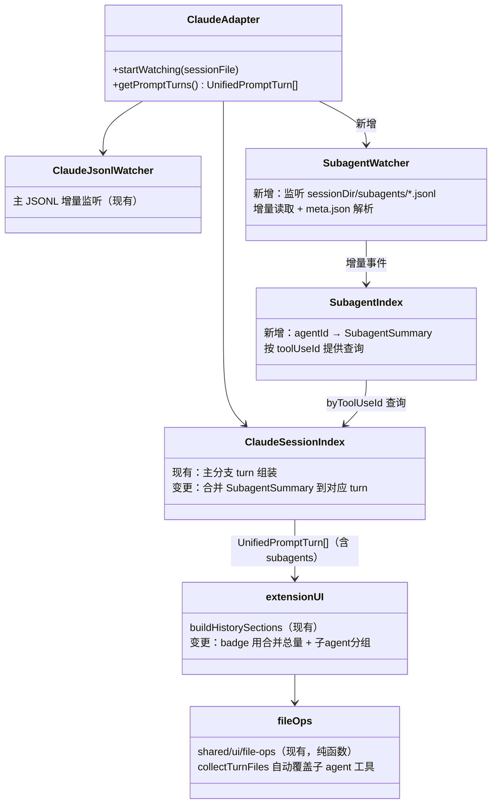
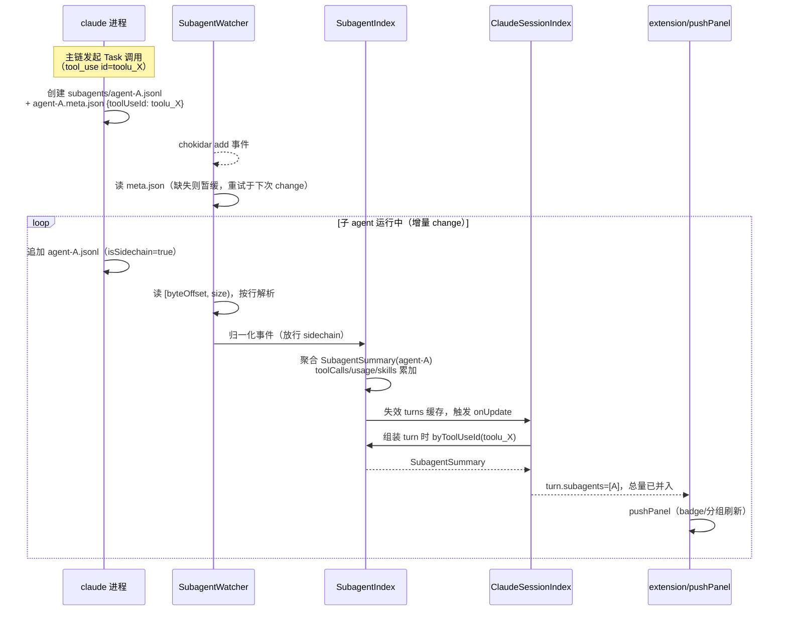
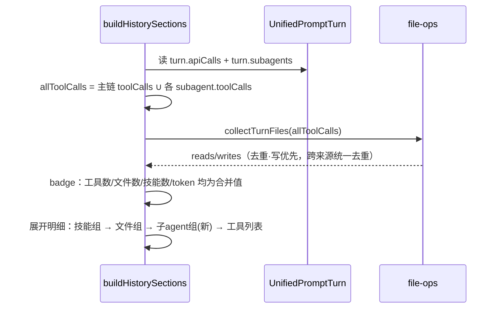

# 子 Agent 调用记录纳入历史统计（SubagentRecords）

> 日期：2026-07-19
> 范围：`termcat_client_plugin/ai-code-power`（Claude 适配器侧；Codex 无子 agent 概念，不涉及）
> 背景文档：`docs/modify_history/2026-07-19-ai-code-power历史记录增强-shell归因-技能-tip多语言.md`

---

## 0. 背景与目标

历史记录三类统计（工具/读写文件/技能/token）目前只覆盖主对话链：解析层直接丢弃 `isSidechain === true` 记录，且新版 Claude Code 的子 agent 完整对话根本不在主 JSONL 里，而是存在独立子目录：

```
~/.claude/projects/<proj>/<session-uuid>/subagents/agent-<agentId>.jsonl
~/.claude/projects/<proj>/<session-uuid>/subagents/agent-<agentId>.meta.json
```

watcher 只监听 `projectDir/*.jsonl`（顶层），子目录从未被读取。实测一个子 agent 文件内含 14 次工具调用、4697 output tokens，面板上全部不可见——子 agent 用得多的会话，token 显示远低于真实消耗，文件/技能记录也不完整。

**目标**：把子 agent 的工具调用、文件读写、技能、token 归并到主链发起 `Task/Agent` 调用的那一轮，badge 反映真实总量，展开明细可区分来源。

**归属依据（已实测确认）**：`agent-<id>.meta.json` 的 `toolUseId` 字段 === 主链 `Task/Agent` tool_use block 的 `id`，可精确关联到轮。meta.json 还携带 `agentType`（如 Explore）与 `description`，可用于展示。

---

## 1. 架构设计 / 模块设计



**模块职责**：

| 模块 | 职责 | 状态 |
|------|------|------|
| `SubagentWatcher`（新增，claude 适配器内） | chokidar 监听 `<sessionDir>/subagents/` 目录；对每个 `agent-*.jsonl` 做字节偏移增量读取（复用现有 watcher 的容错模式：截断重置、解析失败计数）；配对读取同名 `.meta.json` | 新文件 |
| `SubagentIndex`（新增） | 用现有 `normalizeRecord` 的宽容模式解析子 agent 事件（子 agent 文件里全部记录 `isSidechain=true`，需放行）；聚合成 `SubagentSummary`（toolUseId、agentType、description、toolCalls、tokenUsage、skills）；提供 `byToolUseId` 查询 | 新文件 |
| `ClaudeSessionIndex`（变更） | turn 组装后，用本轮所有 `kind='task'` tool call 的 id 去 `SubagentIndex` 查询，命中的 summary 挂到 `turn.subagents`，并把其 token/技能并入 turn 总量 | 改动小 |
| `jsonl-parser`（变更） | `normalizeRecord` 增加"放行 sidechain"开关（仅 SubagentIndex 使用；主链解析行为不变） | 一行开关 |
| `adapters/types.ts`（变更） | `UnifiedSubagentSummary` 新类型；`UnifiedPromptTurn` 增加 `subagents` 字段 | 类型扩展 |
| `shared/ui/file-ops.ts` | `collectTurnFiles` 追加遍历 `turn.subagents` 的 toolCalls（实现时调整：其签名接收整个 turn，改函数内部比改所有调用点签名更小） | 小改 |
| `extension.ts`（变更） | badge 计数改用"主链 + 子 agent"合并值；展开明细新增「子 agent · N」分组 | UI 层 |

**Codex 适配器**：不涉及，`subagents` 恒为空。

---

## 2. 关键流程时序图

### 2.1 子 agent 文件监听与归属（核心流程）

前置条件：ClaudeAdapter 已 `startWatching(sessionFile)`；后置条件：面板显示含子 agent 的合并统计。



错误分支：
- `meta.json` 不存在或无 `toolUseId` → summary 进入"未归属"暂存区，每次该 agent 文件 change 时重试读 meta；始终无法归属的 summary 不计入任何 turn（宁缺勿错挂）。
- `toolUseId` 在主链任何 turn 中找不到（主 JSONL 尚未追到该 tool_use）→ 同样暂存，主链 watcher 每次更新后重新尝试归属（турn 缓存失效时自然重算）。
- 子 agent 文件解析连续失败 → 沿用现有 corrupted 标记策略，跳过该 agent，不影响其他。

### 2.2 面板渲染合并（UI 侧）



---

## 3. 关键逻辑

### 3.1 归并口径（本方案最关键的决策）

**问题**：子 agent 的消耗算不算"本轮"的？badge 显示合并值还是主链值？

**候选**：
- A. **badge 全并入 + 展开明细单独分组**（推荐）：badge 反映本轮真实总消耗（用户点一次 prompt 实际花掉的 token / 动过的文件就是这些）；展开后「子 agent · N」分组保留来源可追溯性。
- B. badge 只算主链，子 agent 仅在展开明细显示：badge 语义"主链自身消耗"更纯粹，但"记录不完整"的观感依旧，与本方案动机相悖。
- C. 双 badge（主链 + 子 agent 各一个）：信息最全但 badge 行已有 7 个，拥挤。

**选 A 理由**：用户视角"这轮花了多少/改了什么"天然包含子 agent（它们是本轮 prompt 的产物）；来源区分放到展开层级，符合现有"badge 概览 + 展开细节"的信息架构。token tooltip 需补一句"含子 agent"说明口径。

### 3.2 归属关联的时序竞态

**问题**：subagents 文件出现时，主链 JSONL 可能还没写到对应 Task tool_use（或反之）；meta.json 可能晚于 jsonl 创建。

**难点**：两个独立文件流没有顺序保证。

**方案**：SubagentIndex 只做"聚合 + 暂存"，归属动作放在 `getPromptTurns()` 组装时按 `toolUseId` 现查——任一侧更新都会失效 turns 缓存并重算，天然收敛，无需跨流同步。meta 缺失的 agent 保持未归属状态，不猜测归属（宁可暂时少显示，不错挂到别的轮）。

### 3.3 sidechain 放行的影响面控制

**问题**：现有 `normalizeRecord` 对 `isSidechain === true` 直接返回 null，子 agent 文件里全部是 sidechain 记录。

**方案**：给归一化入口加一个仅 `SubagentIndex` 使用的放行开关；主链解析路径完全不变。被否决方案：全局放行再靠 agentId 过滤——老版本 Claude Code 会把 sidechain 内联写进主 JSONL，全局放行会让这些记录混进主分支 DAG（叶节点选择、turn 切分都会被污染），风险大于收益。

### 3.4 子 agent 内的技能与文件

- 技能：子 agent 文件同样有 Skill tool_use 与 UserMeta 技能加载记录，复用 `extractSkillInfos` 的双来源合并逻辑，结果并入 turn 技能集合（同名去重）。
- 文件：子 agent 的 Read/Edit/Bash 等经现有 `toolFileOps` 分类（含 shell 归因），与主链统一进 `collectTurnFiles` 去重（写优先跨来源生效：主链读过、子 agent 写过 → 只计写）。
- token：子 agent 每次 API 调用的 usage 与主链同 schema，直接累加进 turn 总量。

### 3.5 工具名 `Task` → `Agent`（实现时发现）

**问题**：真实数据回放显示归属为 0——新版 Claude Code 的子 agent 工具名已从 `Task` 改为 `Agent`，而 `classifyTool` 仅精确匹配 `Task`，导致 kind 不为 `task`、归属查询被跳过。

**方案**：`classifyTool` 同时精确匹配 `Task`（旧版）与 `Agent`（新版）→ kind `task`。必须精确匹配——`TaskCreate`/`TaskUpdate` 等是任务清单工具，不是子 agent。修复后全量回放：48 个会话、104 个轮次归属成功。

### 3.6 watcher 生命周期

子 agent 目录随 session 变化：`startWatching(newFile)` 时需连带切换 SubagentWatcher 到新 session 的子目录；`stopWatching` 连带关闭。沿用现有 ref-count/dispose 模式，不引入新的生命周期形态。

---

## 4. 接口说明

本方案无对外 API；以下为内部模块契约（仅签名）：

| 位置 | 签名 | 说明 |
|------|------|------|
| `adapters/types.ts` | `interface UnifiedSubagentSummary { agentId: string; toolUseId: string; agentType?: string; description?: string; toolCalls: UnifiedToolCall[]; tokenUsage: UnifiedTokenUsage; skills: UnifiedSkillInfo[] }` | 单个子 agent 的聚合摘要 |
| `adapters/types.ts` | `UnifiedPromptTurn.subagents: UnifiedSubagentSummary[]` | 新字段；`totalTokens`/`skills` 为已并入子 agent 的合并值（Codex 恒空数组） |
| `adapters/claude/subagent-watcher.ts` | `class SubagentWatcher { watch(sessionDir: string): void; stop(): void; onUpdate(cb): Disposable }` | 目录监听 + 增量读取 |
| `adapters/claude/subagent-index.ts` | `class SubagentIndex { addEvents(agentId, meta, events): void; byToolUseId(id: string): UnifiedSubagentSummary \| null }` | 聚合与查询 |
| `adapters/claude/jsonl-parser.ts` | `normalizeRecord(rec, opts?: { allowSidechain?: boolean })` | 默认 false，主链行为不变 |

UI 侧「子 agent」分组沿用现有 `text` 标题 + nested `list` 模板（条目：`agentType · description`、工具数与 token 摘要，tooltip 含完整信息）。子 agent 列表 `selectable`，点击条目（事件 `list:select`，sectionId `turn-<n>-subagents`，item id `<turnIndex>-subagent-<i>`）弹出明细弹窗（`showMessage` tabs：概览 / 工具 / 文件（读写清单）/ 技能）。locale 三份新增分组标题、tooltip 与弹窗 tab key（沿用现有 i18n 机制）。

---

## 5. 遗留问题

1. **P1 旧版内联 sidechain 不支持**：老版本 Claude Code 把子 agent 记录以 `isSidechain=true` 内联写在主 JSONL（无 subagents 子目录）。本方案仅覆盖子目录格式（当前版本实测格式）；旧会话的子 agent 仍不可见。处理时机：确有回看旧会话需求时，按 `agentId` 分组内联记录补一条解析路径。
2. **P2 子 agent 调用明细查看**：~~本方案只做统计归并~~ 已于同日实现——点击子 agent 条目弹出明细弹窗（概览 / 工具清单 / 读写文件 / 技能）。仍未做的部分：子 agent 的**原始 SSE/JSONL round-trip 重建**（类似主链「查看原始记录」），有需求再加。
3. **P3 嵌套子 agent**：子 agent 再派生子 agent 时（理论上 subagents 目录是否嵌套未实测），本方案只归并一层。出现真实用例再验证目录结构并递归。
4. **P4 claude_code_power 未同步**：参考插件同样不含子 agent 记录，如需对齐可移植同一套 watcher/index（它有独立 i18n 与展示结构）。
5. **P5 token badge 语义变化**：badge 从"主链消耗"变为"含子 agent 总消耗"，与 claude_code_power 同名 badge 口径不再一致；已通过 tooltip 说明，若用户需要区分可回看 3.1 候选 C。
